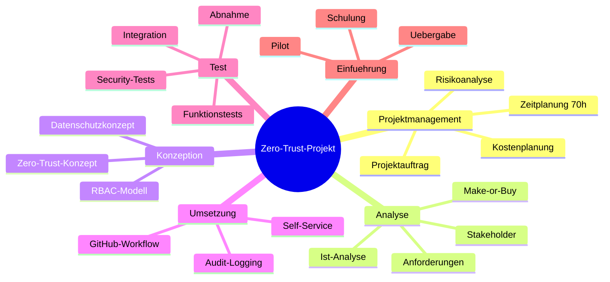

# Mermaid: Projektstrukturplan (PSP)

```mermaid
mindmap
  root((Zero-Trust-Projekt))
    Projektmanagement
      Projektauftrag
      Zeitplanung 70h
      Kostenplanung
      Risikoanalyse
    Analyse
      Ist-Analyse
      Anforderungen
      Stakeholder
      Make-or-Buy
    Konzeption
      Zero-Trust-Konzept
      RBAC-Modell
      Datenschutzkonzept
    Umsetzung
      GitHub-Workflow
      Self-Service
      Audit-Logging
    Test
      Funktionstests
      Security-Tests
      Integration
      Abnahme
    Einfuehrung
      Pilot
      Schulung
      Uebergabe
```
