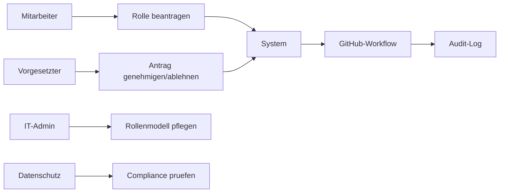

# Mermaid: Use-Case-Diagramm

```mermaid
flowchart LR
  M[Mitarbeiter] --> A1[Rolle beantragen]
  V[Vorgesetzter] --> A2[Antrag genehmigen/ablehnen]
  IT[IT-Admin] --> A3[Rollenmodell pflegen]
  DS[Datenschutz] --> A4[Compliance pruefen]
  A1 --> S[System]
  A2 --> S
  S --> G[GitHub-Workflow]
  G --> L[Audit-Log]
```
