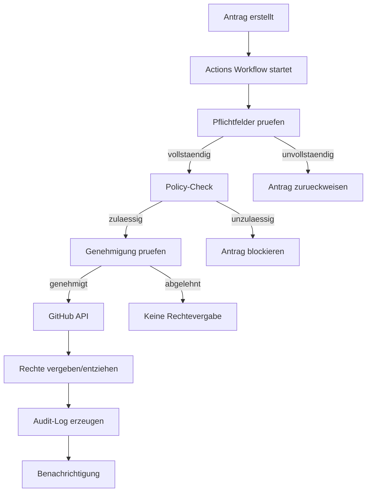

# Mermaid: GitHub-Workflow

```mermaid
flowchart TD
  A[Antrag erstellt] --> B[Actions Workflow startet]
  B --> C[Pflichtfelder pruefen]
  C -->|vollstaendig| D[Policy-Check]
  C -->|unvollstaendig| X[Antrag zurueckweisen]
  D -->|zulaessig| E[Genehmigung pruefen]
  D -->|unzulaessig| Y[Antrag blockieren]
  E -->|genehmigt| F[GitHub API]
  E -->|abgelehnt| Z[Keine Rechtevergabe]
  F --> G[Rechte vergeben/entziehen]
  G --> H[Audit-Log erzeugen]
  H --> I[Benachrichtigung]
```
