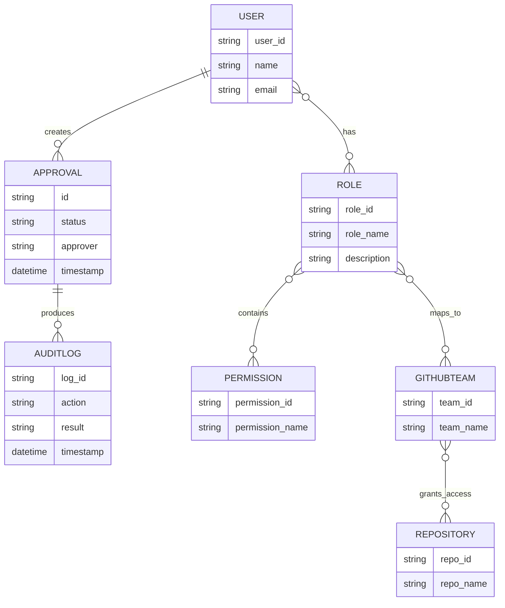

# Mermaid: RBAC-Datenmodell (ERD)

```mermaid
erDiagram
  USER ||--o{ APPROVAL : creates
  USER }o--o{ ROLE : has
  ROLE }o--o{ PERMISSION : contains
  APPROVAL ||--o{ AUDITLOG : produces
  ROLE }o--o{ GITHUBTEAM : maps_to
  GITHUBTEAM }o--o{ REPOSITORY : grants_access

  USER {
    string user_id
    string name
    string email
  }
  ROLE {
    string role_id
    string role_name
    string description
  }
  PERMISSION {
    string permission_id
    string permission_name
  }
  APPROVAL {
    string id
    string status
    string approver
    datetime timestamp
  }
  AUDITLOG {
    string log_id
    string action
    string result
    datetime timestamp
  }
  GITHUBTEAM {
    string team_id
    string team_name
  }
  REPOSITORY {
    string repo_id
    string repo_name
  }
```
