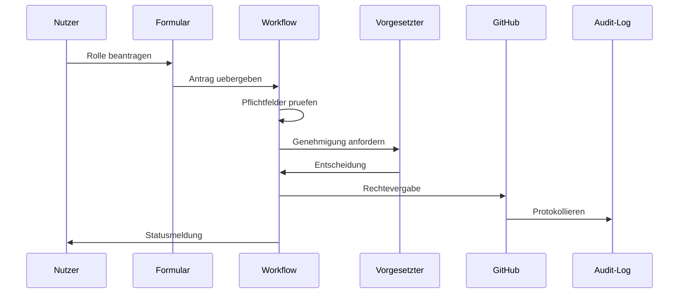

# Mermaid: Self-Service-Prozess

```mermaid
sequenceDiagram
  participant N as Nutzer
  participant F as Formular
  participant W as Workflow
  participant V as Vorgesetzter
  participant G as GitHub
  participant A as Audit-Log

  N->>F: Rolle beantragen
  F->>W: Antrag uebergeben
  W->>W: Pflichtfelder pruefen
  W->>V: Genehmigung anfordern
  V->>W: Entscheidung
  W->>G: Rechtevergabe
  G->>A: Protokollieren
  W->>N: Statusmeldung
```
