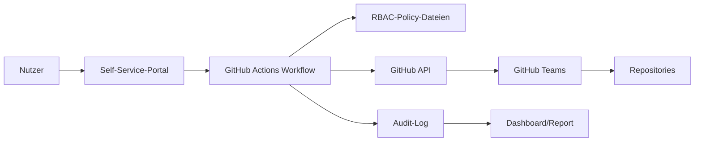

# Mermaid: Schnittstellenuebersicht

```mermaid
flowchart LR
  N[Nutzer] --> P[Self-Service-Portal]
  P --> W[GitHub Actions Workflow]
  W --> RBAC[RBAC-Policy-Dateien]
  W --> API[GitHub API]
  API --> T[GitHub Teams]
  T --> R[Repositories]
  W --> AL[Audit-Log]
  AL --> D[Dashboard/Report]
```
