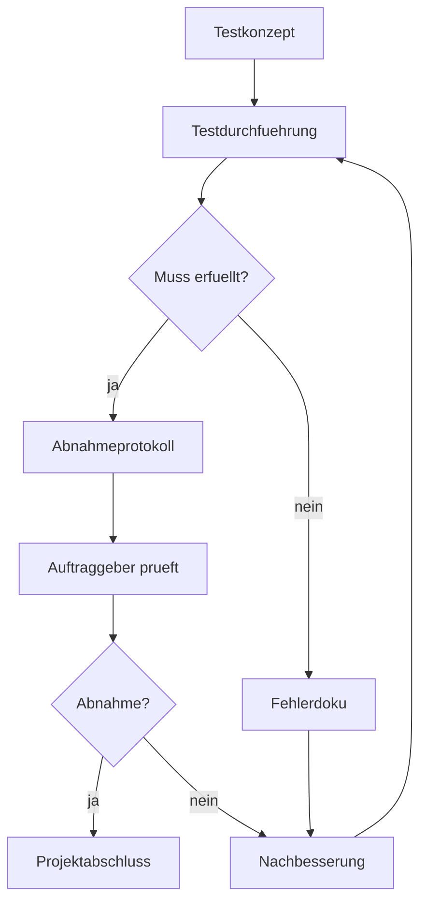

# Mermaid: Abnahmeprozess

```mermaid
flowchart TD
  T[Testkonzept] --> D[Testdurchfuehrung]
  D --> P{Muss erfuellt?}
  P -->|ja| AP[Abnahmeprotokoll]
  P -->|nein| F[Fehlerdoku]
  F --> N[Nachbesserung]
  N --> D
  AP --> AG[Auftraggeber prueft]
  AG --> E{Abnahme?}
  E -->|ja| S[Projektabschluss]
  E -->|nein| N
```
