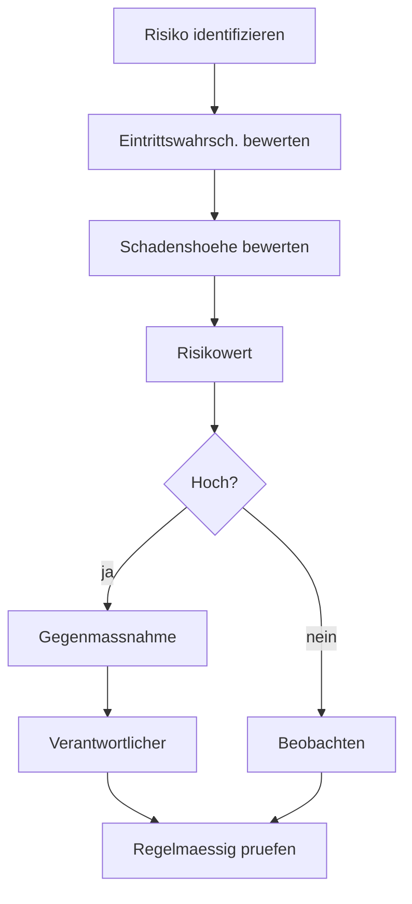

# Mermaid: Risikoprozess

```mermaid
flowchart TD
  A[Risiko identifizieren] --> B[Eintrittswahrsch. bewerten]
  B --> C[Schadenshoehe bewerten]
  C --> D[Risikowert]
  D --> E{Hoch?}
  E -->|ja| F[Gegenmassnahme]
  E -->|nein| G[Beobachten]
  F --> H[Verantwortlicher]
  H --> I[Regelmaessig pruefen]
  G --> I
```
