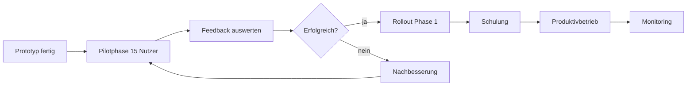

# Mermaid: Rollout-Plan

```mermaid
flowchart LR
  A[Prototyp fertig] --> B[Pilotphase 15 Nutzer]
  B --> C[Feedback auswerten]
  C --> D{Erfolgreich?}
  D -->|ja| E[Rollout Phase 1]
  D -->|nein| F[Nachbesserung]
  F --> B
  E --> G[Schulung]
  G --> H[Produktivbetrieb]
  H --> I[Monitoring]
```
