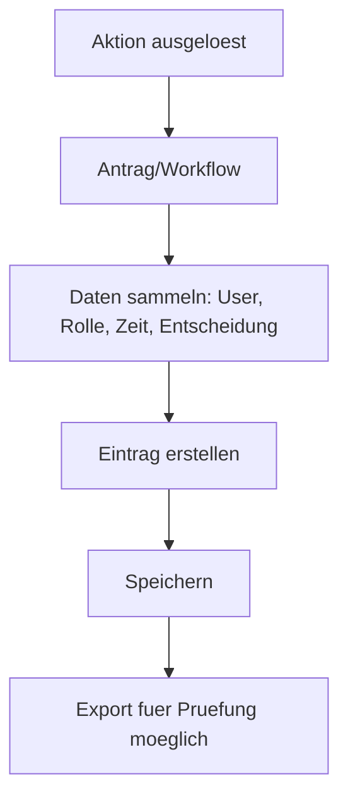

# Mermaid: Audit-Log-Prozess

```mermaid
flowchart TD
  A[Aktion ausgeloest] --> B[Antrag/Workflow]
  B --> C[Daten sammeln: User, Rolle, Zeit, Entscheidung]
  C --> D[Eintrag erstellen]
  D --> E[Speichern]
  E --> F[Export fuer Pruefung moeglich]
```
