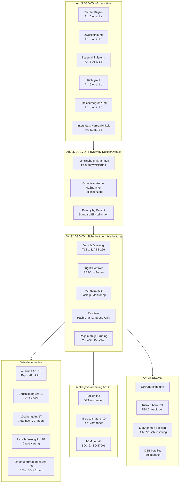

# Mermaid: DSGVO-Checkliste zur Rollen- und Zugriffskontrolle

```mermaid
flowchart TB
    subgraph Art5[Art. 5 DSGVO - Grundsätze]
        A5_1[Rechtmäßigkeit\nArt. 5 Abs. 1 a]
        A5_2[Zweckbindung\nArt. 5 Abs. 1 b]
        A5_3[Datenminimierung\nArt. 5 Abs. 1 c]
        A5_4[Richtigkeit\nArt. 5 Abs. 1 d]
        A5_5[Speicherbegrenzung\nArt. 5 Abs. 1 e]
        A5_6[Integrität & Vertraulichkeit\nArt. 5 Abs. 1 f]
    end

    subgraph Art25[Art. 25 DSGVO - Privacy by Design/Default]
        A25_1[Technische Maßnahmen\nPseudonymisierung]
        A25_2[Organisatorische Maßnahmen\nRollenkonzept]
        A25_3[Privacy by Default\nStandard-Einstellungen]
    end

    subgraph Art32[Art. 32 DSGVO - Sicherheit der Verarbeitung]
        A32_1[Verschlüsselung\nTLS 1.3, AES-256]
        A32_2[Zugriffskontrolle\nRBAC, 4-Augen]
        A32_3[Verfügbarkeit\nBackup, Monitoring]
        A32_4[Resilienz\nHash-Chain, Append-Only]
        A32_5[Regelmäßige Prüfung\nCodeQL, Pen-Test]
    end

    subgraph Rechte[Betroffenenrechte]
        R1[Auskunft Art. 15\nExport-Funktion]
        R2[Berichtigung Art. 16\nSelf-Service]
        R3[Löschung Art. 17\nAuto nach 30 Tagen]
        R4[Einschränkung Art. 18\nDeaktivierung]
        R5[Datenübertragbarkeit Art. 20\nCSV/JSON Export]
    end

    subgraph AVV[Auftragsverarbeitung Art. 28]
        AV1[GitHub Inc.\nDPA vorhanden]
        AV2[Microsoft Azure AD\nDPA vorhanden]
        AV3[TOM geprüft\nSOC 2, ISO 27001]
    end

    subgraph DPIA[Art. 35 DSGVO]
        D1[DPIA durchgeführt]
        D2[Risiken bewertet\nRBAC, Audit-Log]
        D3[Maßnahmen definiert\nTOM, Verschlüsselung]
        D4[DSB beteiligt\nFreigegeben]
    end

    Art5 --> Art25
    Art25 --> Art32
    Art32 --> Rechte
    Art32 --> AVV
    Art32 --> DPIA
```