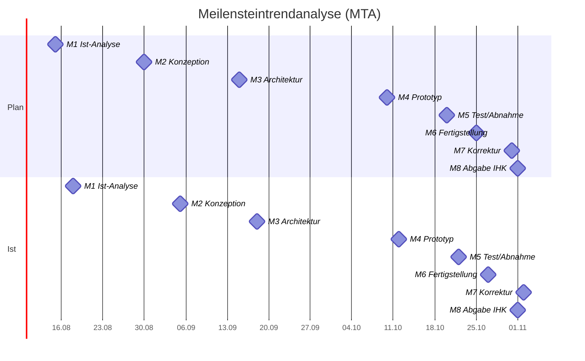

# Mermaid: Meilensteintrendanalyse (MTA)

```mermaid
gantt
    title Meilensteintrendanalyse (MTA)
    dateFormat  YYYY-MM-DD
    axisFormat  %d.%m
    todayMarker stroke-width:2,stroke:red,color:red

    section Plan
    M1 Ist-Analyse           :milestone, m1p, 2026-08-15, 0d
    M2 Konzeption            :milestone, m2p, 2026-08-30, 0d
    M3 Architektur           :milestone, m3p, 2026-09-15, 0d
    M4 Prototyp              :milestone, m4p, 2026-10-10, 0d
    M5 Test/Abnahme          :milestone, m5p, 2026-10-20, 0d
    M6 Fertigstellung        :milestone, m6p, 2026-10-25, 0d
    M7 Korrektur             :milestone, m7p, 2026-10-31, 0d
    M8 Abgabe IHK            :milestone, m8p, 2026-11-01, 0d

    section Ist
    M1 Ist-Analyse           :milestone, m1i, 2026-08-18, 0d
    M2 Konzeption            :milestone, m2i, 2026-09-05, 0d
    M3 Architektur           :milestone, m3i, 2026-09-18, 0d
    M4 Prototyp              :milestone, m4i, 2026-10-12, 0d
    M5 Test/Abnahme          :milestone, m5i, 2026-10-22, 0d
    M6 Fertigstellung        :milestone, m6i, 2026-10-27, 0d
    M7 Korrektur             :milestone, m7i, 2026-11-02, 0d
    M8 Abgabe IHK            :milestone, m8i, 2026-11-01, 0d
```