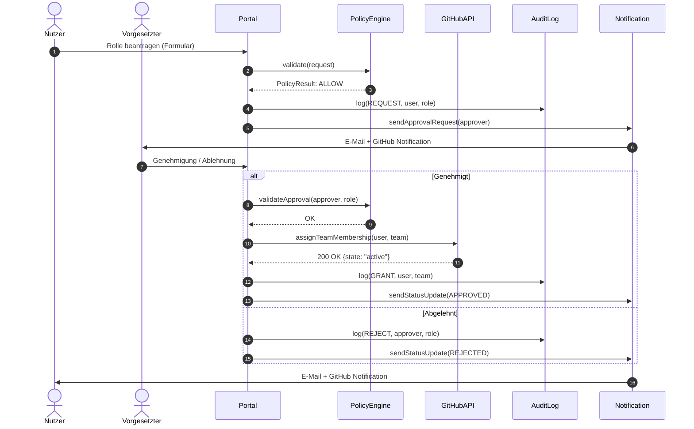

# Mermaid: Beispielhafter Testfall mit Soll-Ist-Ergebnis

```mermaid
sequenceDiagram
    autonumber
    actor Nutzer
    actor Vorgesetzter
    participant Portal
    participant PolicyEngine
    participant GitHubAPI
    participant AuditLog
    participant Notification

    Nutzer->>Portal: Rolle beantragen (Formular)
    Portal->>PolicyEngine: validate(request)
    PolicyEngine-->>Portal: PolicyResult: ALLOW
    Portal->>AuditLog: log(REQUEST, user, role)
    Portal->>Notification: sendApprovalRequest(approver)
    Notification->>Vorgesetzter: E-Mail + GitHub Notification
    Vorgesetzter->>Portal: Genehmigung / Ablehnung
    alt Genehmigt
        Portal->>PolicyEngine: validateApproval(approver, role)
        PolicyEngine-->>Portal: OK
        Portal->>GitHubAPI: assignTeamMembership(user, team)
        GitHubAPI-->>Portal: 200 OK {state: "active"}
        Portal->>AuditLog: log(GRANT, user, team)
        Portal->>Notification: sendStatusUpdate(APPROVED)
    else Abgelehnt
        Portal->>AuditLog: log(REJECT, approver, role)
        Portal->>Notification: sendStatusUpdate(REJECTED)
    end
    Notification->>Nutzer: E-Mail + GitHub Notification
```