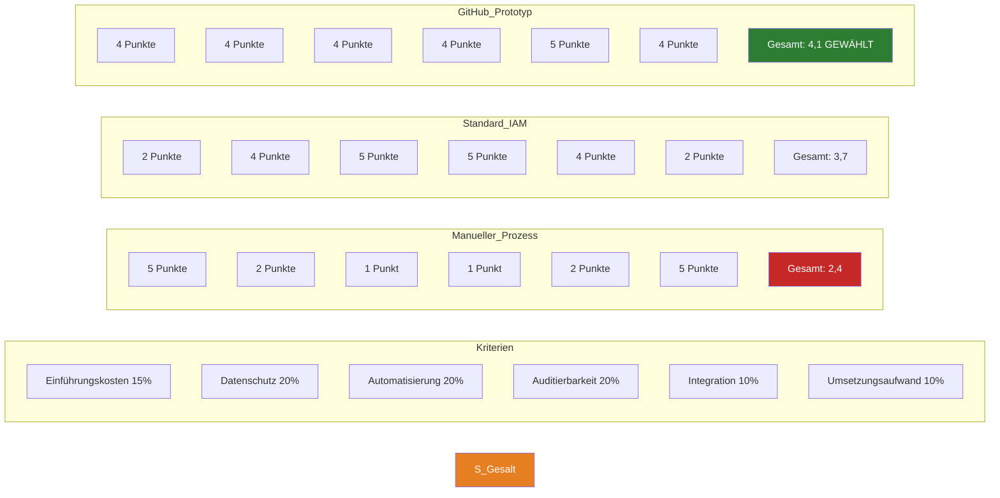

# Mermaid: Vergleichsmatrix Identity-Management-Systeme

```mermaid
graph LR
    subgraph Kriterien
    K1[Einführungskosten 15%]
    K2[Datenschutz 20%]
    K3[Automatisierung 20%]
    K4[Auditierbarkeit 20%]
    K5[Integration 10%]
    K6[Umsetzungsaufwand 10%]
    end

    subgraph Manueller_Prozess
    M1[5 Punkte]
    M2[2 Punkte]
    M3[1 Punkt]
    M4[1 Punkt]
    M5[2 Punkte]
    M6[5 Punkte]
    M_Gesamt[Gesamt: 2,4]
    end

    subgraph Standard_IAM
    S1[2 Punkte]
    S2[4 Punkte]
    S3[5 Punkte]
    S4[5 Punkte]
    S5[4 Punkte]
    S6[2 Punkte]
    S_Gesamt[Gesamt: 3,7]
    end

    subgraph GitHub_Prototyp
    G1[4 Punkte]
    G2[4 Punkte]
    G3[4 Punkte]
    G4[4 Punkte]
    G5[5 Punkte]
    G6[4 Punkte]
    G_Gesamt[Gesamt: 4,1 GEWÄHLT]
    end

    style G_Gesamt fill:#2D7D32,color:#fff
    style S_Gesalt fill:#E67E22,color:#fff
    style M_Gesamt fill:#C62828,color:#fff
```