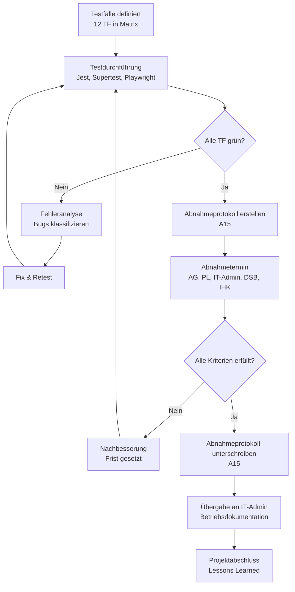

# Mermaid: Abnahmeprozess

```mermaid
flowchart TD
    A[Testfälle definiert\n12 TF in Matrix] --> B[Testdurchführung\nJest, Supertest, Playwright]
    B --> C{Alle TF grün?}
    C -- Nein --> D[Fehleranalyse\nBugs klassifizieren]
    D --> E[Fix & Retest]
    E --> B
    C -- Ja --> F[Abnahmeprotokoll erstellen\nA15]
    F --> G[Abnahmetermin\nAG, PL, IT-Admin, DSB, IHK]
    G --> H{Alle Kriterien erfüllt?}
    H -- Nein --> I[Nachbesserung\nFrist gesetzt]
    I --> B
    H -- Ja --> J[Abnahmeprotokoll unterschreiben\nA15]
    J --> K[Übergabe an IT-Admin\nBetriebsdokumentation]
    K --> L[Projektabschluss\nLessons Learned]
```