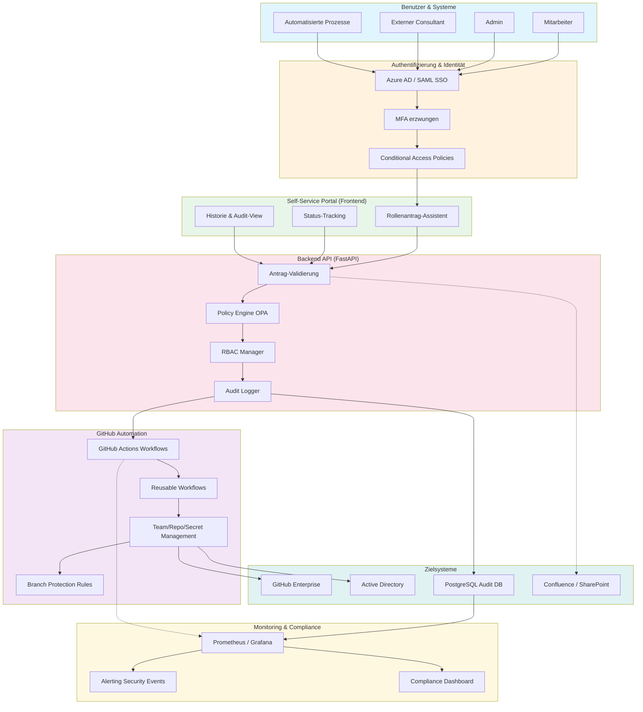

# Mermaid: Zero-Trust-Zielarchitektur

```mermaid
flowchart TB
    subgraph User["Benutzer & Systeme"]
        U1[Mitarbeiter] 
        U2[Admin]
        U3[Externer Consultant]
        U4[Automatisierte Prozesse]
    end

    subgraph Auth["Authentifizierung & Identität"]
        A1[Azure AD / SAML SSO]
        A2[MFA erzwungen]
        A3[Conditional Access Policies]
    end

    subgraph Portal["Self-Service Portal (Frontend)"]
        P1[Rollenantrag-Assistent]
        P2[Status-Tracking]
        P3[Historie & Audit-View]
    end

    subgraph API["Backend API (FastAPI)"]
        B1[Antrag-Validierung]
        B2[Policy Engine OPA]
        B3[RBAC Manager]
        B4[Audit Logger]
    end

    subgraph Automation["GitHub Automation"]
        G1[GitHub Actions Workflows]
        G2[Reusable Workflows]
        G3[Team/Repo/Secret Management]
        G4[Branch Protection Rules]
    end

    subgraph Target["Zielsysteme"]
        T1[GitHub Enterprise]
        T2[Active Directory]
        T3[PostgreSQL Audit DB]
        T4[Confluence / SharePoint]
    end

    subgraph Monitoring["Monitoring & Compliance"]
        M1[Prometheus / Grafana]
        M2[Alerting Security Events]
        M3[Compliance Dashboard]
    end

    U1 --> A1
    U2 --> A1
    U3 --> A1
    U4 --> A1

    A1 --> A2
    A2 --> A3
    A3 --> P1

    P1 --> B1
    P2 --> B1
    P3 --> B1

    B1 --> B2
    B2 --> B3
    B3 --> B4

    B4 --> G1
    G1 --> G2
    G2 --> G3
    G3 --> G4

    G3 --> T1
    G3 --> T2
    B4 --> T3
    B1 -.-> T4

    T3 --> M1
    G1 -.-> M1
    M1 --> M2
    M1 --> M3

    style User fill:#e1f5fe
    style Auth fill:#fff3e0
    style Portal fill:#e8f5e9
    style API fill:#fce4ec
    style Automation fill:#f3e5f5
    style Target fill:#e0f2f1
    style Monitoring fill:#fff8e1
```

**Abb. X: Zero-Trust-Zielarchitektur – Übersicht der Komponenten und Datenflüsse**