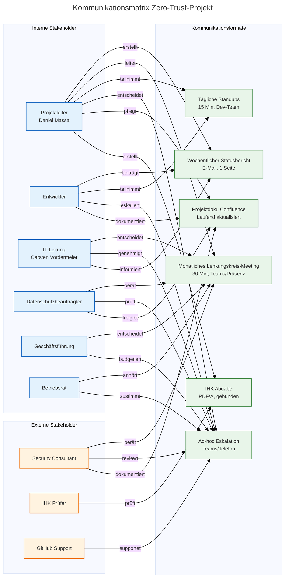

# Mermaid: Kommunikationsmatrix (Stakeholder-Kommunikation)

```mermaid
---
title: Kommunikationsmatrix Zero-Trust-Projekt
---
%%{init: {'theme': 'base', 'themeVariables': {'fontSize': '12px'}}}%%
flowchart LR
    subgraph Intern["Interne Stakeholder"]
        S1[Projektleiter\nDaniel Massa]
        S2[Entwickler]
        S3[IT-Leitung\nCarsten Vordermeier]
        S4[Datenschutzbeauftragter]
        S5[Geschäftsführung]
        S6[Betriebsrat]
    end

    subgraph Extern["Externe Stakeholder"]
        E1[Security Consultant]
        E2[IHK Prüfer]
        E3[GitHub Support]
    end

    subgraph Formate["Kommunikationsformate"]
        F1[Wöchentlicher Statusbericht\nE-Mail, 1 Seite]
        F2[Monatliches Lenkungskreis-Meeting\n30 Min, Teams/Präsenz]
        F3[Tägliche Standups\n15 Min, Dev-Team]
        F4[Ad-hoc Eskalation\nTeams/Telefon]
        F5[Projektdoku Confluence\nLaufend aktualisiert]
        F6[IHK Abgabe\nPDF/A, gebunden]
    end

    S1 -->|erstellt| F1
    S1 -->|leitet| F2
    S1 -->|teilnimmt| F3
    S1 -->|entscheidet| F4
    S1 -->|pflegt| F5
    S1 -->|erstellt| F6

    S2 -->|beiträgt| F1
    S2 -->|teilnimmt| F3
    S2 -->|eskaliert| F4
    S2 -->|dokumentiert| F5

    S3 -->|entscheidet| F2
    S3 -->|genehmigt| F4
    S3 -->|informiert| F1

    S4 -->|berät| F2
    S4 -->|prüft| F4
    S4 -->|freigibt| F5

    S5 -->|entscheidet| F2
    S5 -->|budgetiert| F4

    S6 -->|anhört| F2
    S6 -->|zustimmt| F4

    E1 -->|berät| F2
    E1 -->|reviewt| F4
    E1 -->|dokumentiert| F5

    E2 -->|prüft| F6
    E3 -->|supportet| F4

    classDef intern fill:#e3f2fd,stroke:#1565c0
    classDef extern fill:#fff3e0,stroke:#ef6c00
    classDef format fill:#e8f5e9,stroke:#2e7d32

    class S1,S2,S3,S4,S5,S6 intern
    class E1,E2,E3 extern
    class F1,F2,F3,F4,F5,F6 format
```

**Abb. X: Kommunikationsmatrix – Stakeholder, Formate, Frequenz & Verantwortlichkeiten**