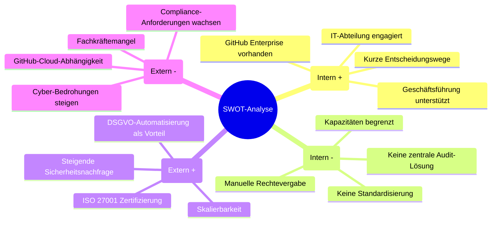

# Mermaid: SWOT-Analyse

```mermaid
mindmap
  root((SWOT-Analyse))
    Stärken (Intern +)
      GitHub Enterprise vorhanden
      IT-Abteilung engagiert
      Geschäftsführung unterstützt
      Kurze Entscheidungswege
    Schwächen (Intern -)
      Manuelle Rechtevergabe
      Keine Standardisierung
      Keine zentrale Audit-Lösung
      Kapazitäten begrenzt
    Chancen (Extern +)
      DSGVO-Automatisierung als Vorteil
      Steigende Sicherheitsnachfrage
      ISO 27001 Zertifizierung
      Skalierbarkeit
    Risiken (Extern -)
      Cyber-Bedrohungen steigen
      Compliance-Anforderungen wachsen
      GitHub-Cloud-Abhängigkeit
      Fachkräftemangel
```