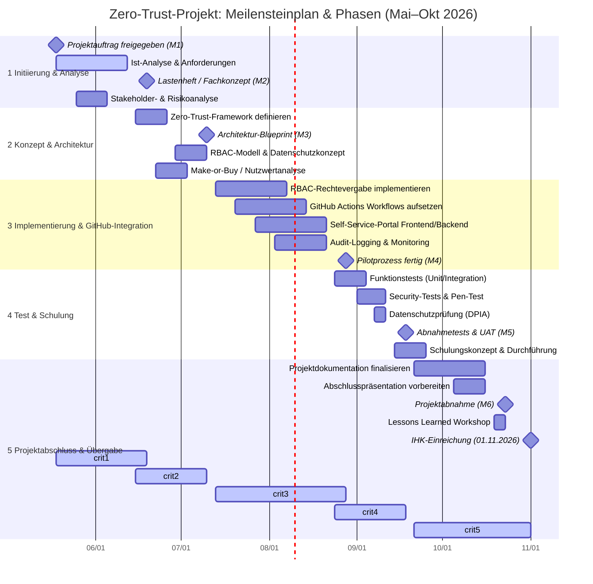

# Mermaid: Meilensteinplan / Projektphasen (Gantt)

```mermaid
gantt
    title Zero-Trust-Projekt: Meilensteinplan & Phasen (Mai–Okt 2026)
    dateFormat  YYYY-MM-DD
    axisFormat  %m/%d
    todayMarker stroke-width:2,stroke:#ff0000,stroke-dasharray: 5,5

    section 1 Initiierung & Analyse
    Projektauftrag freigegeben (M1)     :milestone, m1, 2026-05-18, 0d
    Ist-Analyse & Anforderungen         :active, a1, 2026-05-18, 2026-06-12
    Lastenheft / Fachkonzept (M2)       :milestone, m2, 2026-06-19, 0d
    Stakeholder- & Risikoanalyse        :a2, 2026-05-25, 2026-06-05

    section 2 Konzept & Architektur
    Zero-Trust-Framework definieren     :k1, 2026-06-15, 2026-06-26
    Architektur-Blueprint (M3)          :milestone, m3, 2026-07-10, 0d
    RBAC-Modell & Datenschutzkonzept    :k2, 2026-06-29, 2026-07-10
    Make-or-Buy / Nutzwertanalyse       :k3, 2026-06-22, 2026-07-03

    section 3 Implementierung & GitHub-Integration
    RBAC-Rechtevergabe implementieren   :i1, 2026-07-13, 2026-08-07
    GitHub Actions Workflows aufsetzen  :i2, 2026-07-20, 2026-08-14
    Self-Service-Portal Frontend/Backend :i3, 2026-07-27, 2026-08-21
    Audit-Logging & Monitoring          :i4, 2026-08-03, 2026-08-21
    Pilotprozess fertig (M4)            :milestone, m4, 2026-08-28, 0d

    section 4 Test & Schulung
    Funktionstests (Unit/Integration)   :t1, 2026-08-24, 2026-09-04
    Security-Tests & Pen-Test           :t2, 2026-09-01, 2026-09-11
    Datenschutzprüfung (DPIA)           :t3, 2026-09-07, 2026-09-11
    Abnahmetests & UAT (M5)             :milestone, m5, 2026-09-18, 0d
    Schulungskonzept & Durchführung     :t4, 2026-09-14, 2026-09-25

    section 5 Projektabschluss & Übergabe
    Projektdokumentation finalisieren   :d1, 2026-09-21, 2026-10-16
    Abschlusspräsentation vorbereiten   :d2, 2026-10-05, 2026-10-16
    Projektabnahme (M6)                 :milestone, m6, 2026-10-23, 0d
    Lessons Learned Workshop            :d3, 2026-10-19, 2026-10-23
    IHK-Einreichung (01.11.2026)        :milestone, m7, 2026-11-01, 0d

    %% Critical Path
    crit1: active, 2026-05-18, 2026-06-19
    crit2: active, 2026-06-15, 2026-07-10
    crit3: active, 2026-07-13, 2026-08-28
    crit4: active, 2026-08-24, 2026-09-18
    crit5: active, 2026-09-21, 2026-11-01
```

**Abb. X: Meilensteinplan mit kritischem Pfad (rot) – 6 Hauptmeilensteine M1–M6 + IHK-Abgabe M7**