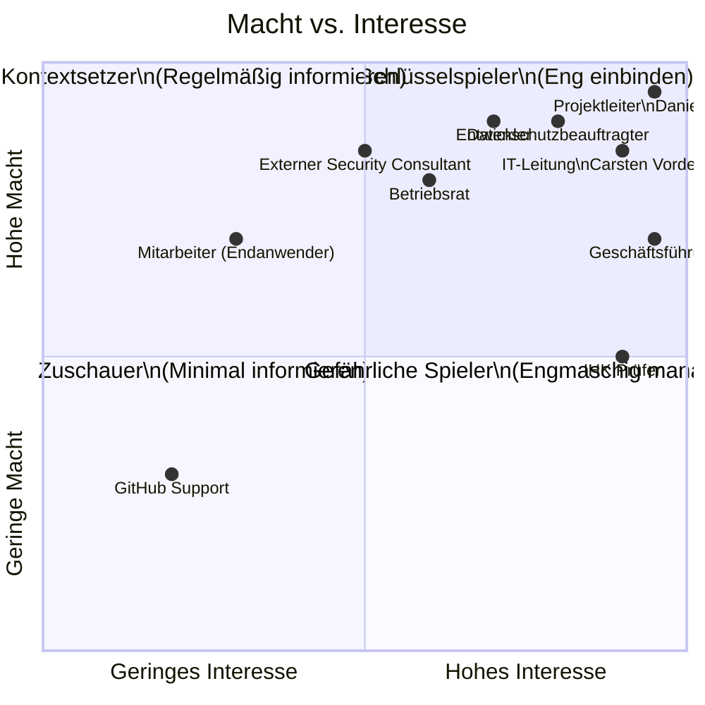

# Mermaid: Stakeholder-Matrix (Macht/Interesse)

**Abb. Y: Stakeholder-Matrix – Einordnung nach Macht und Interesse (RZ-Vorbild)**

| Stakeholder | Macht | Interesse | Kategorie | Maßnahmen |
|-------------|-------|-----------|-----------|-----------|
| Projektleiter Daniel Massa | Sehr hoch | Sehr hoch | **Schlüsselspieler** | Tägliche Steuerung, volle Verantwortung |
| IT-Leitung Carsten Vordermeier | Sehr hoch | Hoch | **Schlüsselspieler** | Lenkungskreis, technische Freigaben |
| Geschäftsführung | Sehr hoch | Mittel | **Kontextsetzer** | Budget, strategische Entscheidungen |
| Datenschutzbeauftragter | Hoch | Sehr hoch | **Schlüsselspieler** | DSGVO-Prüfung, TOM-Freigabe |
| Entwickler | Mittel | Sehr hoch | **Schlüsselspieler** | Operative Umsetzung, tägliche Syncs |
| Betriebsrat | Mittel | Hoch | **Kontextsetzer** | Mitbestimmung §87 BetrVG, anhören |
| Ext. Security Consultant | Mittel | Hoch | **Kontextsetzer** | Reviews, Pen-Test, Beratung |
| IHK Prüfer | Sehr hoch | Gering | **Gefährlicher Spieler** | Formale Kriterien prüfen, keine Überraschungen |
| Mitarbeiter (Endanwender) | Gering | Mittel | **Zuschauer** | Pilot-User, Feedback, Schulung |
| GitHub Support | Gering | Gering | **Zuschauer** | Nur bei Störungen kontaktieren |