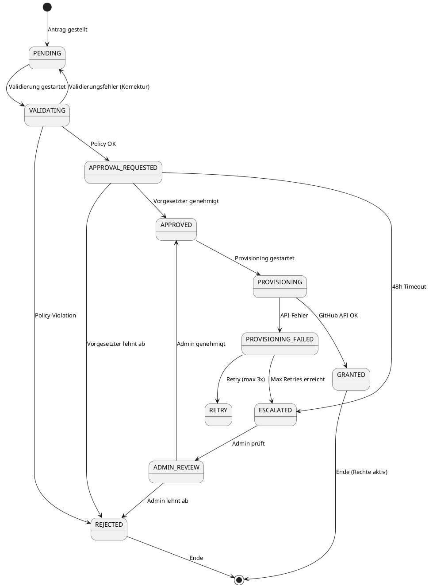
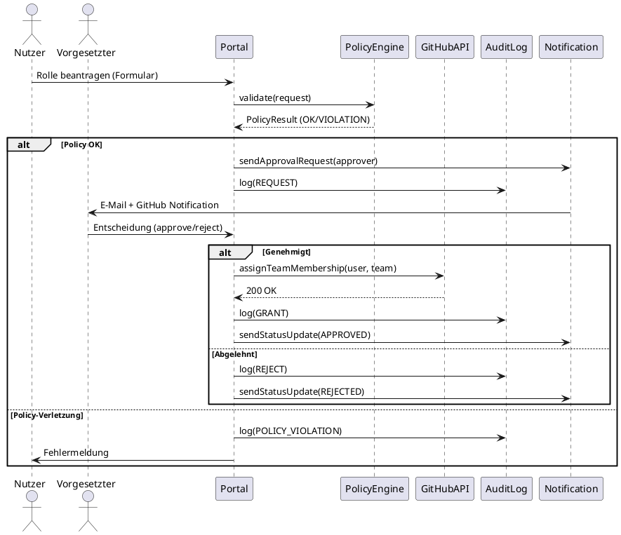

# Anhang A12 — Klassendiagramm (UML)

**Projekt:** Zero-Trust-Sicherheitskonzept mit GitHub-Integration  
**Version:** 1.0 | **Datum:** 09.07.2026

---

## Klassendiagramm (PlantUML)

```plantuml
@startuml
' ============================
' Zero-Trust RBAC Klassendiagramm
' ============================

skinparam classAttributeIconSize 0
skinparam arrowColor #4B5563
skinparam classBackgroundColor #F9FAFB
skinparam classBorderColor #2E5C8A
skinparam classHeaderBackgroundColor #2E5C8A
skinparam classHeaderFontColor #FFFFFF
skinparam arrowThickness 1.5

package "Domain Model" {
    class User {
        - id: UUID
        - azureAdId: String
        - email: String
        - fullName: String
        - department: String
        - isActive: Boolean
        - createdAt: DateTime
        + getRoles(): List<Role>
        + hasPermission(permission: String): Boolean
        + createRequest(role: Role, reason: String): RoleRequest
    }

    class Role {
        - id: UUID
        - name: String
        - description: String
        - isSystemRole: Boolean
        + getPermissions(): List<Permission>
        + getUsers(): List<User>
        + getGitHubTeam(): GitHubTeam?
    }

    class Permission {
        - id: UUID
        - name: String
        - resource: String
        - action: String  <<read, write, admin, manage>>
        - scope: String
    }

    class GitHubTeam {
        - id: UUID
        - githubTeamId: Long
        - name: String
        + addMember(user: User): Boolean
        + removeMember(user: User): Boolean
        + getRepositories(): List<Repository>
    }

    class Repository {
        - id: UUID
        - githubRepoId: Long
        - name: String
        - organization: String
    }

    class Approval {
        - id: UUID
        - status: Enum {pending, approved, rejected, escalated}
        - requestedAt: DateTime
        - decidedAt: DateTime?
        - rejectionReason: String?
        + approve(approver: User): void
        + reject(approver: User, reason: String): void
        + escalate(): void
    }

    class AuditLog {
        - id: Long
        - timestamp: DateTime
        - action: String
        - resourceType: String
        - resourceId: UUID?
        - result: Enum {success, failed, pending}
        - details: JSON
        - previousHash: String
        - currentHash: String
        + verifyChain(): Boolean
    }

    class RoleRequest {
        - id: UUID
        - status: Enum {pending, approved, rejected, escalated}
        - reason: String
        - resource: String?
        - requestedAt: DateTime
        - decidedAt: DateTime?
    }
}

package "Services" {
    class RoleService {
        + createRole(name: String, description: String): Role
        + assignRole(user: User, role: Role): void
        + revokeRole(user: User, role: Role): void
        + getUserRoles(user: User): List<Role>
    }

    class ApprovalService {
        + createRequest(user: User, role: Role, reason: String): RoleRequest
        + approve(request: RoleRequest, approver: User): void
        + reject(request: RoleRequest, approver: User, reason: String): void
        + escalate(request: RoleRequest): void
    }

    class GitHubIntegrationService {
        + syncTeamMembership(user: User, team: GitHubTeam): Boolean
        + revokeTeamMembership(user: User, team: GitHubTeam): Boolean
        + getTeamMemberships(user: User): List<GitHubTeam>
        + syncAllTeams(): SyncResult
    }

    class AuditService {
        + log(action: String, user: User, resource: Object, result: Enum): AuditLog
        + export(from: Date, to: Date, format: Enum): File
        + verifyIntegrity(): Boolean
    }

    class PolicyEngine {
        + validate(request: RoleRequest): PolicyResult
        + checkFourEyes(request: RoleRequest): Boolean
        + checkCompetenceMatrix(user: User, role: Role): Boolean
        + checkResourceLimits(user: User, role: Role): Boolean
    }

    class NotificationService {
        + sendApprovalRequest(request: RoleRequest): void
        + sendStatusUpdate(request: RoleRequest): void
        + sendEscalationAlert(request: RoleRequest): void
    }
}

package "Infrastructure" {
    class GitHubApiClient {
        + assignTeamMembership(username: String, teamSlug: String): Boolean
        + revokeTeamMembership(username: String, teamSlug: String): Boolean
        + getTeamMembers(teamSlug: String): List<String>
        + createTeam(name: String, privacy: String): GitHubTeam
    }

    class DatabaseRepository {
        + save(entity: Object): void
        + findById(id: UUID): Object?
        + findAll(): List<Object>
        + executeNativeQuery(sql: String): List<Map>
    }

    class CacheService {
        + get(key: String): Object?
        + put(key: String, value: Object, ttl: Duration): void
        + evict(key: String): void
    }
}

' ============================
' Beziehungen
' ============================

' User ↔ Role (N:M über UserRole)
User "1" -- "*" UserRole : hat
UserRole "*" -- "1" Role : wird_zugewiesen

' Role ↔ Permission (N:M)
Role "1" -- "*" RolePermission : hat
RolePermission "*" -- "1" Permission : gehört_zu

' Role → GitHubTeam (1:1)
Role "1" -- "0..1" GitHubTeam : mapped_to

' GitHubTeam ↔ Repository (N:M)
GitHubTeam "1" -- "*" GitHubTeamRepository : hat_zugriff
GitHubTeamRepository "*" -- "1" Repository : gehört_zu

' User → RoleRequest (1:N)
User "1" -- "*" RoleRequest : beantragt

' RoleRequest → Approval (1:1)
RoleRequest "1" -- "1" Approval : wird_entschieden

' Approval → AuditLog (1:N)
Approval "1" -- "*" AuditLog : erzeugt

' User → AuditLog (1:N)
User "1" -- "*" AuditLog : ausgelöst_von

' Services nutzen Repositories
RoleService --> DatabaseRepository
ApprovalService --> DatabaseRepository
GitHubIntegrationService --> GitHubApiClient
AuditService --> DatabaseRepository
PolicyEngine --> DatabaseRepository
NotificationService --> DatabaseRepository

' Services untereinander
ApprovalService --> PolicyEngine : validiert
ApprovalService --> GitHubIntegrationService : provisioned
ApprovalService --> AuditService : loggt
ApprovalService --> NotificationService : benachrichtigt

@enduml
```

---

## Klassendiagramm: Zustandsdiagramm (RoleRequest)

---

## Klassendiagramm: Sequenzdiagramm (Genehmigungsfluss)

---

## Export-Hinweise

| Format | Befehl | Zweck |
|--------|--------|-------|
| SVG | `plantuml -tsvg A12_Klassendiagramm.puml` | Vektorgrafik für PDF/DOCX |
| PNG | `plantuml -tpng A12_Klassendiagramm.puml` | Rastergrafik (300 DPI) |
| PDF | `plantuml -tpdf A12_Klassendiagramm.puml` | Direkt als PDF |

---

## Legende

| Symbol | Bedeutung |
|--------|-----------|
| `1` | genau 1 |
| `0..1` | 0 oder 1 |
| `*` | 0..n |
| `1..*` | 1..n |
| `--` | Assoziation |
| `-->` | Abhängigkeit / Nutzung |
| `--*` | Komposition |
| `--o` | Aggregation |
| `<|--` | Vererbung |

---

*Ende Anhang A12. Rendern mit PlantUML (`plantuml.jar` oder VS Code Extension). Vgl. Kapitel 4.5 der Projektarbeit.*