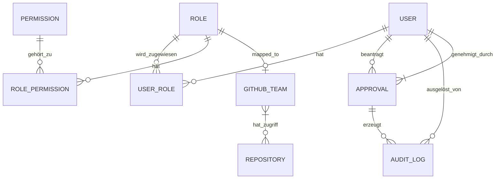
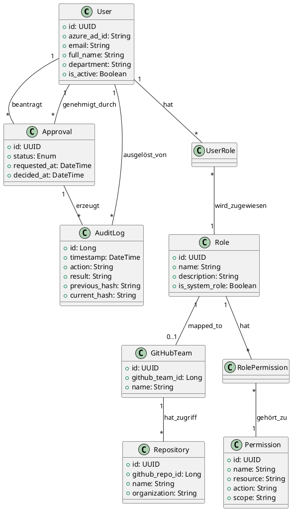

# Anhang A5 — Datenmodell (ERD & SQL-DDL)

**Projekt:** Zero-Trust-Sicherheitskonzept mit GitHub-Integration  
**Version:** 1.0 | **Datum:** 09.07.2026

---

## Entity-Relationship-Diagramm (Mermaid)



---

## Tabellen-Definitionen (PostgreSQL DDL)

```sql
-- Users (Nutzer, via Azure AD synchronisiert)
CREATE TABLE "user" (
    id UUID PRIMARY KEY DEFAULT gen_random_uuid(),
    azure_ad_id VARCHAR(255) UNIQUE NOT NULL,
    email VARCHAR(255) UNIQUE NOT NULL,
    full_name VARCHAR(255) NOT NULL,
    department VARCHAR(100),
    is_active BOOLEAN DEFAULT true,
    created_at TIMESTAMPTZ DEFAULT now(),
    updated_at TIMESTAMPTZ DEFAULT now()
);

-- Rollen
CREATE TABLE role (
    id UUID PRIMARY KEY DEFAULT gen_random_uuid(),
    name VARCHAR(100) UNIQUE NOT NULL,
    description TEXT,
    is_system_role BOOLEAN DEFAULT false,
    created_at TIMESTAMPTZ DEFAULT now()
);

-- Berechtigungen (granular: resource + action + scope)
CREATE TABLE permission (
    id UUID PRIMARY KEY DEFAULT gen_random_uuid(),
    name VARCHAR(100) UNIQUE NOT NULL,
    resource VARCHAR(100) NOT NULL,
    action VARCHAR(50) NOT NULL,      -- read, write, admin, delete
    scope VARCHAR(50)                 -- org, repo, team, self
);

-- N:M User ↔ Role
CREATE TABLE user_role (
    user_id UUID NOT NULL REFERENCES "user"(id) ON DELETE CASCADE,
    role_id UUID NOT NULL REFERENCES role(id) ON DELETE CASCADE,
    assigned_at TIMESTAMPTZ DEFAULT now(),
    assigned_by UUID REFERENCES "user"(id),
    PRIMARY KEY (user_id, role_id)
);

-- N:M Role ↔ Permission
CREATE TABLE role_permission (
    role_id UUID NOT NULL REFERENCES role(id) ON DELETE CASCADE,
    permission_id UUID NOT NULL REFERENCES permission(id) ON DELETE CASCADE,
    PRIMARY KEY (role_id, permission_id)
);

-- GitHub Team Mapping (1:1 Role → GitHub Team)
CREATE TABLE github_team (
    id UUID PRIMARY KEY DEFAULT gen_random_uuid(),
    github_team_id BIGINT UNIQUE NOT NULL,
    name VARCHAR(255) NOT NULL,
    role_id UUID UNIQUE REFERENCES role(id) ON DELETE SET NULL
);

-- Repository Mapping (N:M GitHub Team ↔ Repository)
CREATE TABLE repository (
    id UUID PRIMARY KEY DEFAULT gen_random_uuid(),
    github_repo_id BIGINT UNIQUE NOT NULL,
    name VARCHAR(255) NOT NULL,
    organization VARCHAR(100) NOT NULL
);

CREATE TABLE github_team_repository (
    github_team_id UUID NOT NULL REFERENCES github_team(id) ON DELETE CASCADE,
    repository_id UUID NOT NULL REFERENCES repository(id) ON DELETE CASCADE,
    permission_level VARCHAR(50) DEFAULT 'pull', -- pull, push, admin, maintain, triage
    PRIMARY KEY (github_team_id, repository_id)
);

-- Approval Workflow (Antrag → Genehmigung)
CREATE TABLE approval (
    id UUID PRIMARY KEY DEFAULT gen_random_uuid(),
    requester_id UUID NOT NULL REFERENCES "user"(id) ON DELETE RESTRICT,
    approver_id UUID REFERENCES "user"(id) ON DELETE SET NULL,
    role_id UUID NOT NULL REFERENCES role(id) ON DELETE RESTRICT,
    status VARCHAR(20) NOT NULL DEFAULT 'pending' CHECK (status IN ('pending','approved','rejected','escalated')),
    requested_at TIMESTAMPTZ DEFAULT now(),
    decided_at TIMESTAMPTZ,
    escalated_at TIMESTAMPTZ,
    comment TEXT
);

-- Audit-Log (Append-Only, Hash-Chain)
CREATE TABLE audit_log (
    id BIGSERIAL PRIMARY KEY,
    timestamp TIMESTAMPTZ DEFAULT now(),
    user_id UUID REFERENCES "user"(id) ON DELETE SET NULL,
    action VARCHAR(50) NOT NULL,
    resource_type VARCHAR(50) NOT NULL,
    resource_id UUID,
    result VARCHAR(20) NOT NULL CHECK (result IN ('success','failed','pending')),
    details JSONB,
    previous_hash CHAR(64),
    current_hash CHAR(64) NOT NULL
);

-- Indizes
CREATE INDEX idx_audit_log_timestamp ON audit_log(timestamp DESC);
CREATE INDEX idx_audit_log_user ON audit_log(user_id);
CREATE INDEX idx_approval_status ON approval(status);
CREATE INDEX idx_user_role_user ON user_role(user_id);
CREATE INDEX idx_user_azure_ad ON "user"(azure_ad_id);

-- Trigger: updated_at aktualisieren
CREATE OR REPLACE FUNCTION update_updated_at_column()
RETURNS TRIGGER AS $$
BEGIN
    NEW.updated_at = now();
    RETURN NEW;
END;
$$ language 'plpgsql';

CREATE TRIGGER update_user_updated_at BEFORE UPDATE ON "user"
    FOR EACH ROW EXECUTE PROCEDURE update_updated_at_column();

-- Trigger: Audit-Log Append-Only (kein UPDATE/DELETE)
CREATE OR REPLACE FUNCTION prevent_audit_log_modification()
RETURNS TRIGGER AS $$
BEGIN
    IF TG_OP IN ('UPDATE', 'DELETE') THEN
        RAISE EXCEPTION 'Audit-Log ist append-only: % Operation nicht erlaubt', TG_OP;
    END IF;
    RETURN NEW;
END;
$$ LANGUAGE plpgsql;

CREATE TRIGGER audit_log_immutable
    BEFORE UPDATE OR DELETE ON audit_log
    FOR EACH ROW EXECUTE FUNCTION prevent_audit_log_modification();

-- Trigger: Hash-Chain für Audit-Log
CREATE OR REPLACE FUNCTION generate_audit_hash()
RETURNS TRIGGER AS $$
DECLARE
    prev_hash CHAR(64);
    hash_input TEXT;
BEGIN
    SELECT current_hash INTO prev_hash
    FROM audit_log
    ORDER BY id DESC
    LIMIT 1;

    IF prev_hash IS NULL THEN
        prev_hash := repeat('0', 64);
    END IF;

    hash_input := COALESCE(NEW.previous_hash, prev_hash) || 
                  NEW.timestamp || 
                  COALESCE(NEW.user_id::text, '') || 
                  NEW.action || 
                  NEW.resource_type || 
                  COALESCE(NEW.resource_id::text, '') || 
                  NEW.result || 
                  COALESCE(NEW.details::text, '');

    NEW.current_hash := encode(digest(hash_input, 'sha256'), 'hex');
    RETURN NEW;
END;
$$ LANGUAGE plpgsql;

CREATE TRIGGER audit_log_hash_chain
    BEFORE INSERT ON audit_log
    FOR EACH ROW EXECUTE FUNCTION generate_audit_hash();
```

---

## Rollen-Initialisierung (Seed-Daten)

```sql
-- Basis-Rollen
INSERT INTO role (name, description, is_system_role) VALUES
('Admin', 'Vollzugriff auf alle Systeme', true),
('Developer', 'Lese-/Schreibzugriff auf Repositories', false),
('Auditor', 'Lesezugriff auf Audit-Logs und Reports', false),
('Read-Only', 'Lesezugriff auf ausgewählte Repositories', false),
('HR-Manager', 'Personalbezogene Rollen im HR-System', false),
('Finance', 'Finanzbezogene Rollen im Finanz-System', false);

-- Beispiel-Berechtigungen
INSERT INTO permission (name, resource, action, scope) VALUES
('repo.read', 'repository', 'read', 'repo'),
('repo.write', 'repository', 'write', 'repo'),
('repo.admin', 'repository', 'admin', 'repo'),
('team.manage', 'team', 'manage', 'org'),
('audit.read', 'audit_log', 'read', 'org'),
('user.manage', 'user', 'manage', 'org');

-- Role ↔ Permission Mapping (Beispiel)
INSERT INTO role_permission (role_id, permission_id)
SELECT r.id, p.id FROM role r, permission p
WHERE (r.name = 'Admin' AND p.name IN ('repo.admin','team.manage','audit.read','user.manage'))
   OR (r.name = 'Developer' AND p.name IN ('repo.read','repo.write'))
   OR (r.name = 'Auditor' AND p.name = 'audit.read')
   OR (r.name = 'Read-Only' AND p.name = 'repo.read');
```

---

## Datenmodell-Diagramm (PlantUML für Klassendiagramm)



---

*Ende Anhang A5. Vgl. Kapitel 4.5 der Projektarbeit. SQL-Schema bereit für Migration.*